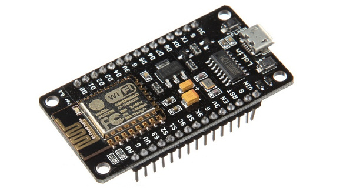
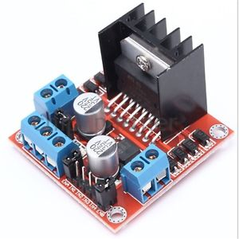
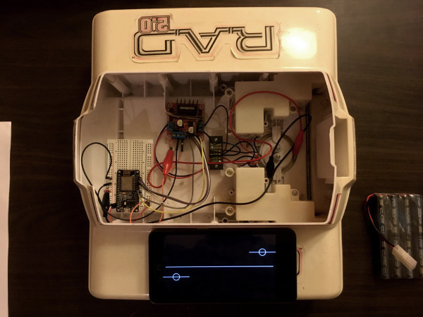
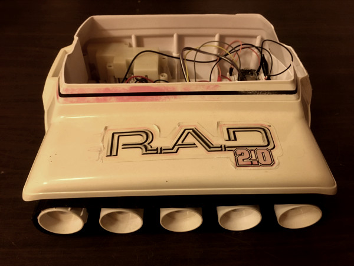

# CoyoteBot

Control an esp8266 tank with an android phone (processing + arduino + esp8266)

## Description

This is a simple [arduino](https://www.arduino.cc/) + [processing](https://processing.org/) (android) project to show how to control electronic devices using an esp8266 based board and an android phone running a [processing](https://processing.org/) sketch.

There are plenty of examples and tutorials around but I could not find a minimally functional straightforward project to start from there. Taking a basic project and improving it is one of the best ways I have found for learning new stuff. Anyway, since there was nothing like what I was looking for, I wrote this little project. 

## Usage

The code is as simple as it gets. It sets up the esp8266 as an access point and the android phone connects to it. 

The communication protocol is based on UDP to make it fast and simple. However, this can be a problem for large separations where there will be missed packets but for my applications (simple learning robot for my kids) this is perfect. I have almost no missed packets. This is easy to see as the robot simply ignores you.

The commands are continuously sent regardless if there is a change in the state or not. A better implementation would be a state machine with something like a "heartbit" updating and cheling status from time to time as done by Hadoop (to check the status of a datacenter).

The "controller" app has two vertical control bars like those in remote controlled tank toys. It can control the speed using pulse width modulation (PWM) and has forward and reverse. The controls can be adjusted at the same time (i.e. multitouch).

If you modify the code keep in mind that it is a bad idea to pass high values to both inputs of the H-bridge at the same time.

## Notes

In order to let the android app communicate to other device we must tell it explicity in the AndroidManifest file:

```xml
<uses-permission android:name="android.permission.INTERNET"/>
```


## CoyoteBot

You can find plenty of robots at trift stores. We found a R.A.D 2.0 toy robot, cut the upper torso and removed the electronics. The result is CoyoteBot, a very nice tank with plenty of space for whatever project we think next.

The esp8266 board we used is the esp8266 ESP12E



driving the motors with an L298N Dual H Bridge Stepper Motor Drive



And finally this is CoyoteBot. It still needs a top cover, I will probably 3D print something to mount a Lego baseplate.






